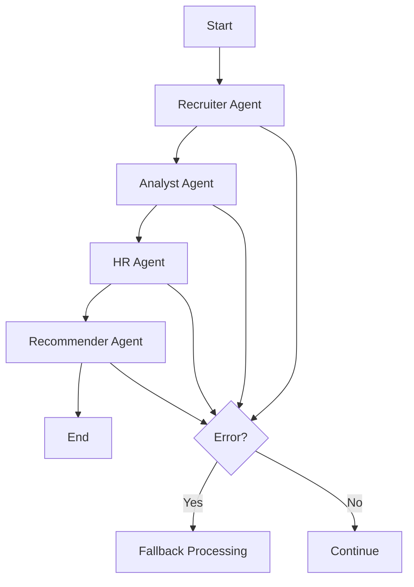

# LangGraph Implementation for Job Smart Selector

## Overview

This document describes the implementation of a minimal LangGraph-inspired workflow for the Job Smart Selector application. Due to API compatibility issues with the current LangGraph version, we implemented a custom workflow system that follows LangGraph principles while providing better state management, error handling, and progress tracking.

## Architecture

### Core Components

1. **LangGraph Types** (`src/types/langgraph.ts`)
   - `RecruitmentState`: Central state interface for the entire workflow
   - `AgentStatus`: Progress tracking for individual agents
   - `RecruitmentWorkflow`: Main workflow interface

2. **LangGraph Agents** (`src/services/langGraphAgents.ts`)
   - `recruiterAgent`: Extracts candidate information from resumes
   - `analystAgent`: Analyzes candidates against job requirements
   - `hrAgent`: Evaluates soft skills and cultural fit
   - `recommenderAgent`: Ranks candidates and selects top performers

3. **Custom Workflow** (`src/services/langGraphWorkflow.ts`)
   - `LangGraphRecruitmentWorkflow`: Main workflow orchestrator (LangGraph-inspired)
   - Sequential agent execution with state management
   - Progress tracking and error handling

4. **Integration Layer** (`src/services/recruitmentService.ts`)
   - Maintains backward compatibility with existing API
   - Provides fallback to legacy processing
   - Real-time progress callbacks

## Workflow Flow



## Key Features

### 1. State Management
- Centralized state using `RecruitmentState`
- Immutable state updates
- Proper state channels configuration

### 2. Progress Tracking
- Real-time agent status updates
- Progress percentage calculation
- Current agent and message tracking

### 3. Error Handling
- Graceful error recovery
- Fallback to legacy processing
- Error aggregation and reporting

### 4. Conditional Routing
- Dynamic workflow routing based on state
- Skip completed steps
- Handle edge cases

## Usage

### Basic Usage
```typescript
import { langGraphWorkflow } from './services/langGraphWorkflow';

const results = await langGraphWorkflow.execute(
  resumes,
  jobDescription,
  (state) => {
    // Progress callback
    console.log('Progress:', state.agentStatuses);
  }
);
```

### With Progress Tracking
```typescript
import { langGraphMultiAgentSystem } from './services/recruitmentService';

// Set up progress callback
langGraphMultiAgentSystem.setProgressCallback((state) => {
  // Update UI with real-time progress
  updateProgressUI(state);
});

const results = await langGraphMultiAgentSystem.processMultipleResumes(
  resumes,
  jobDescription
);
```

## Testing

### Test Page
Navigate to `/test-langgraph` to access the test dashboard:
- Run workflow with sample data
- View real-time progress updates
- Inspect detailed results
- Monitor agent statuses

### Manual Testing
```typescript
// In browser console
window.testLangGraph().then(result => {
  console.log('Test result:', result);
});
```

## Configuration

### Graph Configuration
```typescript
const config: GraphConfig = {
  maxConcurrency: 1,
  timeout: 300000, // 5 minutes
  retryAttempts: 3
};
```

### Agent Configuration
Each agent can be configured with:
- Custom execution logic
- Error handling strategies
- Progress reporting intervals

## Benefits Over Previous Implementation

1. **Better State Management**: Centralized state with proper immutability
2. **Real-time Progress**: Live updates during processing
3. **Error Recovery**: Graceful handling of failures
4. **Scalability**: Easy to add new agents or modify workflow
5. **Testing**: Dedicated test infrastructure
6. **Monitoring**: Comprehensive progress and status tracking

## Future Enhancements

1. **Parallel Processing**: Run compatible agents in parallel
2. **Dynamic Routing**: More sophisticated conditional logic
3. **Agent Composition**: Compose complex agents from simpler ones
4. **Persistence**: Save and resume workflow state
5. **Metrics**: Detailed performance and success metrics

## Dependencies

- `@langchain/langgraph`: Core LangGraph functionality
- `@langchain/core`: LangChain core utilities

## Files Modified

- `src/types/langgraph.ts` - New types and interfaces
- `src/services/langGraphAgents.ts` - Agent implementations
- `src/services/langGraphWorkflow.ts` - Main workflow
- `src/services/recruitmentService.ts` - Integration layer
- `src/pages/Processing.tsx` - UI integration
- `src/pages/TestLangGraph.tsx` - Test interface
- `src/test/langGraphTest.ts` - Test utilities

## Backward Compatibility

The implementation maintains full backward compatibility with the existing API. The `langGraphMultiAgentSystem.processMultipleResumes()` method works exactly as before, but now uses the LangGraph workflow internally with fallback to legacy processing if needed.
